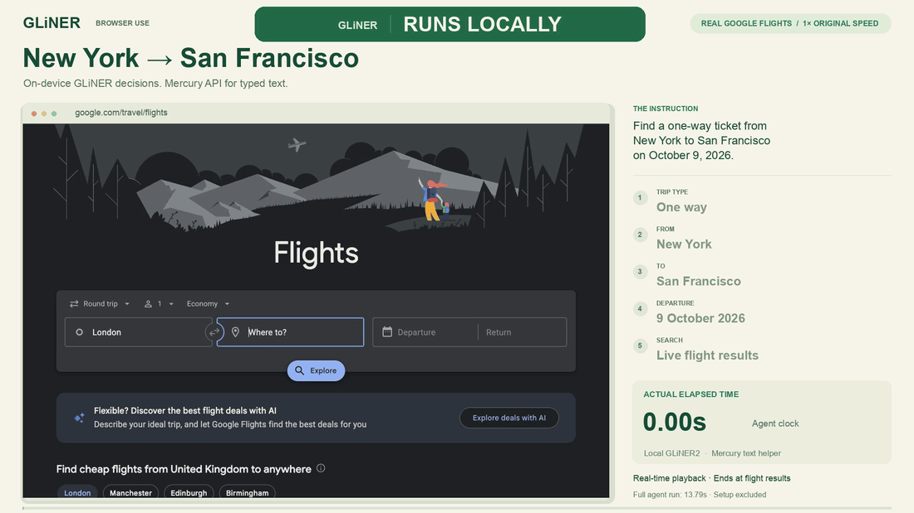

# GLiNER Browser Use

### Local inference. Open weights. Real browser actions.

**Run the decision model on your own machine.** GLiNER2 extracts requirements and scores the controls on each page. A small text model supplies field values when typing is needed.

Built with [Fastino](https://fastino.ai)’s open-weight [GLiNER2 model](https://huggingface.co/fastino/gliner2-multi-v1). The demo uses **local GLiNER2** with **Mercury 2.5 through an API for typed text**. The default setup is hybrid, not fully offline.

[Watch the MP4](docs/demo.mp4) · [Model weights](https://huggingface.co/fastino/gliner2-multi-v1) · [How it works](docs/architecture.md) · [Contribute](CONTRIBUTING.md)

> **Work in progress.** We’re building this in the open and would love your help. Try new workflows, improve control matching, explore local text models, and contribute reproducible evaluations. Reliability varies by website and task; verify outcomes independently.

## What runs locally?

| Component | Where it runs |
|---|---|
| GLiNER2 requirement extraction and control scoring | Your machine, with downloadable model weights |
| Browser observation and action execution | Your local Chrome browser |
| Text generation for form fields | Configurable OpenAI-compatible endpoint; Mercury via OpenRouter by default |

GLiNER reads structured text from observed page controls. It does not use screenshots or a hosted decision-model API. The text helper receives the goal, selected field, page context and recent actions, so that part of the default workflow uses an external service.

## Try it

You’ll need Python 3.12+, [uv](https://docs.astral.sh/uv/), Chrome, and an OpenRouter API key for the default text helper. Model weights download on first use.

```bash
git clone https://github.com/sahibzada-allahyar/gliner2-ultrafast.git
cd gliner2-ultrafast
uv sync --frozen
cp .env.example .env
```

Add your text-model key to `.env`, then start Chrome and check the connection:

```bash
uv run browser-harness --doctor
uv run --env-file .env gliner
```

Open **http://127.0.0.1:8766** to try the local inspector. Follow Browser Harness’s connection instructions if the doctor does not report an active browser connection.

The inspector can show the next choice before executing it, run continuously, and export a trace. It opens an owned tab in your existing Chrome profile, which can share cookies and site preferences.

### Run a goal from the command line

```bash
uv run --env-file .env python examples/run.py \
  --url 'https://www.google.com/travel/flights?hl=en' \
  --goal 'Find a one-way ticket from New York to San Francisco on October 9, 2026.'
```

The CLI accepts any starting URL and natural-language goal; it is not limited to the recorded flight route. For example, try the same policy on walking directions:

```bash
uv run --env-file .env python examples/run.py \
  --url 'https://www.google.com/maps?hl=en' \
  --goal 'Get directions from Berlin Hauptbahnhof to Brandenburg Gate. Select Walking.'
```

Both the flight search and this walking-directions workflow were exercised on real websites during development. New goals and website changes can behave differently. The inspector also includes two explicitly labeled local fixtures for exploring controls; those fixtures are separate from the live-web agent and recorded demo.

Use a future date when trying the flight example. For an independently checked recording of the demo task:

```bash
uv run --env-file .env python scripts/record_flights_demo.py artifacts/new-run
```

The recorder’s goal and post-run verifier describe the same example. If you change the example route or date, update both. Those expectations are not passed to the agent’s decision policy.

### Use the Python API

```python
from gliner_ultrafast import Agent

with Agent(
    "https://www.google.com/travel/flights?hl=en",
    "Find a one-way ticket from New York to San Francisco on October 9, 2026.",
) as agent:
    for state in agent.run():
        print(state["elapsed_ms"], state["status"])
```

Run your script with `uv run --env-file .env python your_script.py`.

## The demo

One natural-language goal, a real website, and controls selected from the observed page. No prepared click sequence or route-specific policy. The agent chooses one way, enters both cities, commits their autocomplete options, sets the date and searches. No ticket is selected or purchased.

- **12.20 seconds to visible results** in the real-time video; the complete action loop took 13.785 seconds.
- **About $0.0001 in API usage** for the recorded run. Local compute and electricity are excluded.
- The clock starts after model loading, goal parsing and initial navigation. Independent outcome verification happens afterward.

The GIF preserves elapsed time at a lower frame rate for README playback. The short video ends before the agent’s final waits and scrolls, with a brief results hold. [Measurement details](docs/demo.md).

## How it works

```text
goal → local GLiNER2 → requirements
                           ↓
page → observed controls → local matching + controller → browser action
                                                        ↓
                                               text helper if needed
```

GLiNER supplies entity spans and control scores. Code handles requirement order, progress, calendar matching, form submission and execution checks. The model chooses among observed controls; it does not generate selectors or executable code.

This is an experimental hybrid controller. `DONE` reports loop termination, so applications should independently check whether the intended result was reached. See the [architecture](docs/architecture.md) for the model/controller boundary.

## Contribute

Help us build better browser automation with **open source and open weights**. We welcome improvements to:

- Control matching, autocomplete, calendars and accessibility patterns.
- Local text-model integrations and inference efficiency.
- Reproducible evaluations across websites and goal wording.
- Documentation, setup and developer experience.

Start with an [issue](https://github.com/sahibzada-allahyar/gliner2-ultrafast/issues) or a pull request. See [CONTRIBUTING.md](CONTRIBUTING.md) for setup and checks. Please redact credentials and private page content from shared traces.

## Credits and license

This project began from [**Browser Use’s Jev Ultrafast**](https://github.com/browser-use/jev-ultrafast). Thank you to Gregor Zunic and the Browser Use team for the original agent, browser integration and demo inspiration. This version adapts the decision layer to local GLiNER2 and retains the upstream MIT notice.

Browser control uses [Browser Harness](https://github.com/browser-use/browser-harness). GLiNER2 is developed by [Fastino](https://github.com/fastino-ai/GLiNER2).

The code is [MIT licensed](LICENSE). The linked GLiNER2 model weights are published under [Apache 2.0](https://huggingface.co/fastino/gliner2-multi-v1); dependencies and text-model services retain their own licenses and terms.
